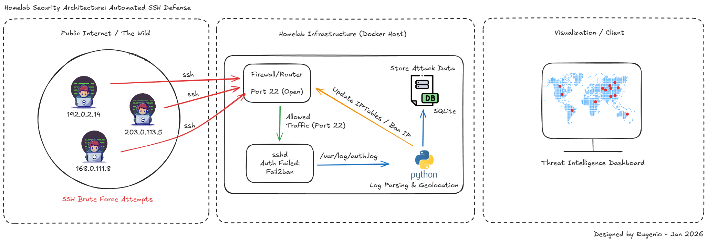

# 🛡️ Homelab Security Architecture: Automated SSH Defense




**Hunter** is a containerized security pipeline designed to protect Homelab infrastructure against brute-force attacks. It creates a closed-loop system that not only blocks threats using a Zero-Trust approach but also visualizes them in real-time.

## 🏗️ Design Overview
This repository documents the security architecture designed to monitor and map global intrusion attempts against a Raspberry Pi-based **Homelab**. The system transforms raw `sshd` logs into an interactive geospatial dashboard.

### 🔄 The Architecture Logic
1.  **Detection**: `sshd` logs authentication failures and connection events.
2.  **Reaction**: Hardened SSH configuration (Key-based auth) and Fail2Ban integration.
3.  **Ingestion**: Python service using `watchdog` for **event-driven** log parsing.
4.  **Intelligence**: IP enrichment via GeoLite2 (MaxMind) for geolocation data.
5.  **Persistence**: Attack telemetry stored in a **SQLite** relational database.
6.  **Visualization**: Dynamic geospatial dashboard rendered via **Folium**.

---

## 🚀 Project Status
- [x] **Phase 1: Hardening**: SSH Configuration & ED25519 Key-based Auth.
- [x] **Phase 2: Log Parsing**: Real-time ingestion via `inotify` events.
- [x] **Phase 3: Data Persistence**: Relational SQLite schema implemented.
- [x] **Phase 4: Visualization**: Automated HTML map generation.

## 🛠️ Tech Stack
* **Core**: Python 3.10, Bash
* **Security**: Fail2Ban, IPTables (Zero-Trust)
* **Infrastructure**: Docker & Docker Compose, Ubuntu Server

---

## 💻 Setup & Execution

To deploy Hunter in your own environment, follow these steps:

### 1. Prerequisites
* **Docker & Docker Compose** installed.
* **MaxMind GeoLite2**: Download the `GeoLite2-City.mmdb` file from MaxMind and place it in the `data/` folder.
* **Log Access**: Ensure the user has read permissions for `/var/log/auth.log`.

### 2. Environment Configuration
Copy the template and fill in your local paths:
```bash
cp .env.example .env
```
### 3. Deployment
Run the following commands to build and start the pipeline:
```bash
# Build and start containers in the background
docker compose up -d --build

# Verify services are running
docker ps

# Monitor logs in real-time
docker compose logs -f parser
```

### 4. Viewing Results
The interactive threat map will be generated and updated in real-time at:
`data/map.html`

---
## 👨‍💻 About the Author
2nd Year Software Engineering Student (GPA: 9.03/10).
Focused on Low-level Systems, Cybersecurity, and Data Science.
